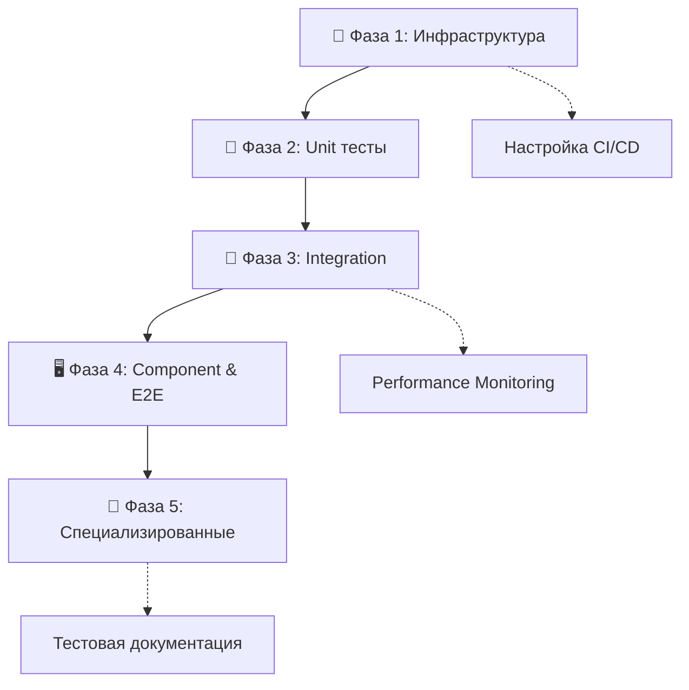
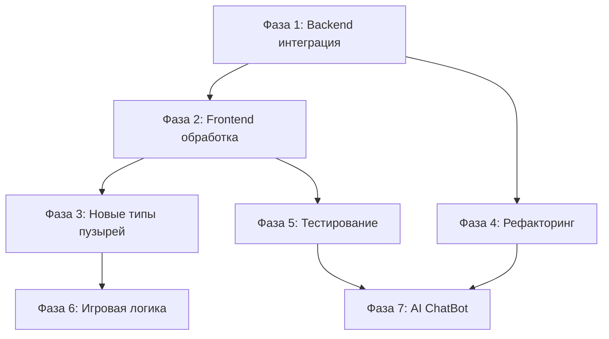

# Tasks - Bubbles Resume

## 🎯 ТЕКУЩИЙ СТАТУС ПРОЕКТА
- **Фаза**: Quality Assurance / Testing Infrastructure
- **Прогресс**: Новая крупная задача - готова к реализации
- **Последнее обновление**: 2024-12-28
- **Задача**: КОМПЛЕКСНОЕ ТЕСТИРОВАНИЕ ПРОЕКТА
- **Сложность**: Level 4 (Крупная архитектурная задача)
- **Статус**: READY TO START 🚀

---

## 🎯 ПРЕДЫДУЩИЕ ЗАДАЧИ (ЗАВЕРШЕНЫ)
- **РЕФАКТОРИНГ СИСТЕМЫ МОДАЛЬНЫХ ОКОН** | Level 2 | COMPLETED ✅ | [Архив](docs/archive/modal-system-refactor-2024-08-01.md)

---

## 🎯 СТАТУС ПРОЕКТА
- **Фаза**: Maintenance / Bug Fixing
- **Прогресс**: Задача полностью завершена и заархивирована
- **Последнее обновление**: 2024-08-02
- **Задача**: ФИКС БАГОВ В HUD И ЛОГИКЕ "КРЕПКИХ" ПУЗЫРЕЙ
- **Сложность**: Level 2 (Отладка и исправление)
- **Статус**: COMPLETED ✅ | [Архив](docs/archive/hud-and-tough-bubble-fixes-2024-08-02.md)

---

## 🧪 ДЕТАЛЬНЫЙ ПЛАН LEVEL 4: КОМПЛЕКСНОЕ ТЕСТИРОВАНИЕ ПРОЕКТА

### 🎯 ЦЕЛЬ ЗАДАЧИ
Создать полноценную тестовую инфраструктуру для текущего состояния проекта, включающую:
- **Unit тесты** для всех ключевых компонентов
- **Integration тесты** для API и компонентного взаимодействия  
- **End-to-End тесты** для полных пользовательских сценариев

### 📋 ОБОСНОВАНИЕ
Проект достиг стабильного состояния с рабочей функциональностью:
- ✅ Canvas-based игра с физикой пузырей
- ✅ Система модальных окон 
- ✅ Звездное небо с GSAP анимациями
- ✅ Система XP, жизней и достижений
- ✅ Философские вопросы и их обработка

**Необходимо зафиксировать текущее поведение тестами** для безопасных будущих изменений.

### 🔍 АНАЛИЗ ТЕКУЩЕГО СОСТОЯНИЯ ТЕСТОВ

#### Существующее тестирование:
- ✅ E2E тесты: `tests/e2e/bubbles.spec.ts` - базовые игровые сценарии
- ✅ E2E тесты: `tests/e2e/critical-fixes.spec.ts` - проверка исправленных багов
- ✅ Playwright конфигурация: `playwright.config.ts`

#### Пробелы в тестировании:
- ❌ Unit тесты для Pinia stores (5 stores)
- ❌ Unit тесты для composables (8 файлов)
- ❌ Integration тесты для API взаимодействия
- ❌ Component тесты для Vue компонентов
- ❌ Тестирование Canvas логики и GSAP анимаций
- ❌ Тесты производительности
- ❌ Визуальные регрессионные тесты

### 🧩 ЗАТРОНУТЫЕ КОМПОНЕНТЫ

#### Stores (Pinia):
- `bubble.store.ts` - логика пузырей и их состояний
- `game.store.ts` - игровая логика, XP, уровни
- `modal.store.ts` - управление модальными окнами
- `session.store.ts` - сессия пользователя и прогресс
- `ui-event.store.ts` - UI события и взаимодействия

#### Composables:
- `useBubbleManager.ts` - управление пузырями
- `useCanvasEffects.ts` - анимации и эффекты
- `useCanvasInteraction.ts` - обработка кликов и взаимодействий
- `useCanvasRenderer.ts` - рендеринг Canvas
- `useCanvasSimulation.ts` - физическая симуляция
- `usePhysicsSimulation.ts` - физика движения пузырей

#### Vue Components:
- Modal компоненты: `BaseModal`, `BubbleModal`, `PhilosophyModal`, etc.
- Game компоненты: `BubbleCanvas`, `GameHUD`, `TimelineSlider`
- UI компоненты: `AchievementsPanel`, `LevelDisplay`, `XPDisplay`

#### Backend API:
- `server/index.ts` - REST API endpoints
- Данные: `mockData.json`, `philosophyQuestions.json`, `contentLevels.json`

## 🚀 ФАЗИРОВАННАЯ СТРАТЕГИЯ РЕАЛИЗАЦИИ

### 🔧 ФАЗА 1: Настройка тестовой инфраструктуры
**Приоритет**: Критический | **Время**: 4-6 часов | **Статус**: Детализирован ✅

#### 📋 АНАЛИЗ СУЩЕСТВУЮЩЕГО СОСТОЯНИЯ
✅ **Уже настроено**:
- Vitest ^1.4.0 - установлен
- @vue/test-utils ^2.4.5 - готов для Vue компонентов
- happy-dom ^14.3.9 - DOM окружение
- @playwright/test ^1.53.1 - E2E тестирование
- TypeScript + Vite конфигурация

❌ **Требует добавления**:
- @pinia/testing - для тестирования stores
- jest-canvas-mock - для Canvas API
- @vitest/coverage-v8 - покрытие кода
- msw - мокирование API запросов
- Vitest конфигурация в vite.config.ts

---

#### 1.1 Установка дополнительных зависимостей
**Время**: 30 минут | **Сложность**: Низкая

- [ ] **1.1.1** Установить недостающие dev dependencies:
  ```bash
  npm install --save-dev @pinia/testing jest-canvas-mock @vitest/coverage-v8 msw @types/jest-canvas-mock
  ```
- [ ] **1.1.2** Проверить совместимость версий с текущим стеком
- [ ] **1.1.3** Обновить package.json scripts при необходимости

#### 1.2 Конфигурация Vitest в vite.config.ts
**Время**: 1 час | **Сложность**: Средняя

- [ ] **1.2.1** Добавить test конфигурацию в `vite.config.ts`:
  ```typescript
  test: {
    globals: true,
    environment: 'happy-dom',
    setupFiles: ['./src/test/setup.ts'],
    coverage: {
      provider: 'v8',
      reporter: ['text', 'html', 'lcov'],
      exclude: ['node_modules/', 'src/test/', '**/*.spec.ts', '**/*.test.ts']
    }
  }
  ```
- [ ] **1.2.2** Настроить aliases для тестовых файлов
- [ ] **1.2.3** Конфигурировать mock patterns и включения/исключения

#### 1.3 Создание тестового setup файла
**Время**: 1 час | **Сложность**: Средняя

- [ ] **1.3.1** Создать `src/test/setup.ts` с основными настройками:
  - Глобальные моки (Canvas, GSAP)
  - Pinia testing configuration
  - DOM полифиллы при необходимости
- [ ] **1.3.2** Настроить Canvas API мокирование:
  ```typescript
  import 'jest-canvas-mock'
  // Или кастомный Canvas mock для специфических потребностей
  ```
- [ ] **1.3.3** Мокирование GSAP для unit тестов:
  ```typescript
  vi.mock('gsap', () => ({
    gsap: { /* мок объект с instant animations */ }
  }))
  ```

#### 1.4 Утилиты для тестирования Pinia stores
**Время**: 1.5 часа | **Сложность**: Высокая

- [ ] **1.4.1** Создать `src/test/helpers/pinia-helpers.ts`:
  - Функция создания тестового Pinia instance
  - Хелперы для мокирования store dependencies
  - Утилиты для snapshot тестирования state
- [ ] **1.4.2** Мокирование inter-store dependencies:
  - Изолированное тестирование каждого store
  - Моки для взаимодействий между stores
- [ ] **1.4.3** Создать базовые тестовые сценарии для каждого store

#### 1.5 Canvas и GSAP тестовые утилиты
**Время**: 2 часа | **Сложность**: Высокая

- [ ] **1.5.1** Создать `src/test/helpers/canvas-helpers.ts`:
  ```typescript
  export function mockCanvas2DContext() {
    // Расширенный мок Canvas 2D context
    // с отслеживанием вызовов рендеринга
  }
  export function mockCanvasElement() {
    // Мок HTMLCanvasElement с размерами
  }
  ```
- [ ] **1.5.2** GSAP testing utilities в `src/test/helpers/gsap-helpers.ts`:
  ```typescript
  export function mockGSAP() {
    // Мок GSAP с instant completion
    // Для snapshot тестирования animation properties
  }
  ```
- [ ] **1.5.3** Physics simulation helpers:
  - Предсказуемые математические функции
  - Фиксированные random values для тестов

#### 1.6 Фикстуры данных и MSW setup
**Время**: 1 час | **Сложность**: Средняя

- [ ] **1.6.1** Создать `src/test/fixtures/` с тестовыми данными:
  - `bubbles.ts` - массивы пузырей разных типов
  - `achievements.ts` - тестовые достижения
  - `philosophy-questions.ts` - философские вопросы
  - `game-state.ts` - различные состояния игры
- [ ] **1.6.2** Настройка MSW для API мокирования:
  ```typescript
  // src/test/mocks/handlers.ts
  export const handlers = [
    rest.get('/api/bubbles', (req, res, ctx) => {
      return res(ctx.json(mockBubbles))
    }),
    // другие API endpoints
  ]
  ```
- [ ] **1.6.3** MSW server setup для интеграционных тестов

#### 1.7 Coverage и CI интеграция
**Время**: 30 минут | **Сложность**: Низкая

- [ ] **1.7.1** Настроить coverage thresholds:
  ```typescript
  coverage: {
    branches: 80,
    functions: 80,
    lines: 80,
    statements: 80
  }
  ```
- [ ] **1.7.2** Добавить npm scripts:
  ```json
  "test:coverage": "vitest run --coverage",
  "test:watch": "vitest",
  "test:ui": "vitest --ui"
  ```
- [ ] **1.7.3** Документация по запуску тестов в README

---

## 🔍 КРИТЕРИИ ЗАВЕРШЕНИЯ ФАЗЫ 1

✅ **Функциональные критерии**:
- [ ] Vitest запускается без ошибок
- [ ] Canvas API успешно мокируется
- [ ] GSAP моки работают корректно
- [ ] Pinia testing helpers созданы
- [ ] MSW обрабатывает API запросы
- [ ] Coverage reporting настроен

✅ **Качественные критерии**:
- [ ] Все тестовые утилиты документированы
- [ ] Примеры использования для каждого helper
- [ ] Производительность тестов приемлема (<5сек для базовых)
- [ ] Моки не влияют на production код

⚠️ **Потенциальные вызовы**:
1. **Canvas мокирование** - может потребовать кастомизации под специфику проекта
2. **GSAP timeline моки** - сложность синхронизации анимаций  
3. **Pinia store interconnections** - правильная изоляция зависимостей

🚀 **Следующий шаг**: После завершения → переход к ФАЗЕ 2 (Unit тестирование stores)

### 🧪 ФАЗА 2: Unit тестирование (Stores + Composables)
**Приоритет**: Высокий | **Время**: 8-10 часов | **Статус**: Зависит от Фазы 1

#### 2.1 Тестирование Pinia Stores
- [ ] **2.1.1** `bubble.store.ts`: состояния пузырей, фильтрация, обновления
- [ ] **2.1.2** `game.store.ts`: игровая логика, XP система, уровни, жизни
- [ ] **2.1.3** `modal.store.ts`: открытие/закрытие модалок, стек модалок
- [ ] **2.1.4** `session.store.ts`: пользовательская сессия, прогресс, достижения
- [ ] **2.1.5** `ui-event.store.ts`: UI события, state transitions

#### 2.2 Тестирование Composables (Canvas & Physics)
- [ ] **2.2.1** `useBubbleManager.ts`: создание, удаление, lifecycle пузырей
- [ ] **2.2.2** `usePhysicsSimulation.ts`: физические расчеты, коллизии
- [ ] **2.2.3** `useCanvasRenderer.ts`: рендеринг логика (с мокированием Canvas)
- [ ] **2.2.4** `useCanvasEffects.ts`: анимации, эффекты (с мокированием GSAP)
- [ ] **2.2.5** `useCanvasInteraction.ts`: клики, drag & drop, hit detection

### 🔗 ФАЗА 3: Integration тестирование
**Приоритет**: Высокий | **Время**: 6-8 часов | **Статус**: Зависит от Фазы 2

#### 3.1 API Integration тесты
- [ ] **3.1.1** Тестирование `/api/bubbles` endpoint
- [ ] **3.1.2** Тестирование загрузки философских вопросов
- [ ] **3.1.3** Тестирование структуры данных content levels
- [ ] **3.1.4** Error handling и fallback сценарии

#### 3.2 Store-Composable Integration
- [ ] **3.2.1** Интеграция game.store + useBubbleManager
- [ ] **3.2.2** Интеграция modal.store + BaseModal компонент
- [ ] **3.2.3** Интеграция session.store + система достижений
- [ ] **3.2.4** Canvas stores + rendering pipeline

#### 3.3 Performance тестирование
- [ ] **3.3.1** Тесты производительности Canvas рендеринга
- [ ] **3.3.2** Memory leaks в GSAP анимациях
- [ ] **3.3.3** Производительность физической симуляции

### 🖥️ ФАЗА 4: Component & E2E тестирование
**Приоритет**: Средний | **Время**: 8-12 часов | **Статус**: Зависит от Фазы 3

#### 4.1 Vue Component тесты
- [ ] **4.1.1** `BaseModal`: рендеринг, события, слоты
- [ ] **4.1.2** `BubbleCanvas`: Canvas инициализация, размеры, события
- [ ] **4.1.3** `GameHUD`: отображение XP, жизней, уровня
- [ ] **4.1.4** Modal компоненты: `BubbleModal`, `PhilosophyModal`, `AchievementModal`
- [ ] **4.1.5** UI компоненты: `AchievementsPanel`, `TimelineSlider`

#### 4.2 Расширение E2E тестов
- [ ] **4.2.1** Полный игровой цикл: загрузка → игра → достижения
- [ ] **4.2.2** Тестирование модальных окон и их взаимодействий
- [ ] **4.2.3** Проверка анимаций и визуальных эффектов
- [ ] **4.2.4** Тестирование философских вопросов flow
- [ ] **4.2.5** Mobile responsive тестирование

#### 4.3 Визуальные регрессионные тесты
- [ ] **4.3.1** Screenshot тестирование key UI states
- [ ] **4.3.2** Проверка Canvas рендеринга
- [ ] **4.3.3** Тестирование анимаций (GSAP)

### 🎯 ФАЗА 5: Специализированное тестирование
**Приоритет**: Низкий | **Время**: 6-8 часов | **Статус**: Зависит от Фазы 4

#### 5.1 Accessibility тестирование
- [ ] **5.1.1** ARIA labels и semantic markup
- [ ] **5.1.2** Keyboard navigation
- [ ] **5.1.3** Screen reader compatibility
- [ ] **5.1.4** Color contrast и visual accessibility

#### 5.2 Cross-browser & Device тестирование
- [ ] **5.2.1** Chrome, Firefox, Safari compatibility
- [ ] **5.2.2** Mobile devices (iOS Safari, Chrome Mobile)
- [ ] **5.2.3** Performance на разных устройствах
- [ ] **5.2.4** Canvas support и fallbacks

#### 5.3 Edge Cases & Error Scenarios
- [ ] **5.3.1** Network failures и API timeouts
- [ ] **5.3.2** Canvas не поддерживается браузером
- [ ] **5.3.3** GSAP loading failures
- [ ] **5.3.4** Очень большие или малые размеры экрана

---

## 🔄 ЗАВИСИМОСТИ И ПОСЛЕДОВАТЕЛЬНОСТЬ



## ⚠️ ТЕХНИЧЕСКИЕ ВЫЗОВЫ И РЕШЕНИЯ

### Canvas Testing:
**Вызов**: Тестирование Canvas логики без реального DOM
**Решение**: 
- Jest Canvas Mock для unit тестов
- Playwright для visual E2E тестирования
- Фикстуры для Canvas 2D context

### GSAP Animation Testing:
**Вызов**: Тестирование временных анимаций
**Решение**:
- Мокирование GSAP с instant completion
- Snapshot тестирование для animation properties
- E2E тесты для полного animation flow

### Physics Simulation:
**Вызов**: Тестирование математических расчетов и collision detection
**Решение**:
- Property-based testing для edge cases
- Фиксированные сценарии для regression тестов
- Performance benchmarks

### State Management:
**Вызов**: Сложные state transitions между stores
**Решение**:
- Isolated store testing с мокированными dependencies
- Integration тесты для store interactions
- State snapshots для regression тестирование

---

## 🏗️ АРХИВ: ДЕТАЛЬНЫЙ ПЛАН LEVEL 4: РАСШИРЕНИЕ СХЕМЫ ПУЗЫРЕЙ

### �� АНАЛИЗ ТРЕБОВАНИЙ

#### Текущее состояние:
- ✅ Типы пузырей: Поддерживается `bubbleType: 'hidden' | 'philosophy' | 'regular'`
- ✅ Философские вопросы: Существуют в `philosophyQuestions.json` с опциями и ответами
- ✅ API структура: Сервер поддерживает `bubbleType`, но философские пузыри не интегрированы
- ⚠️ Проблема: Философские пузыри и обычные пузыри существуют раздельно

#### Целевое состояние:
- 🎯 Единый API endpoint возвращающий объединенный массив всех типов пузырей
- 🎯 Интегрированная обработка философских пузырей на клиенте
- 🎯 Расширенная схема для будущих типов (`project`, `user-input`)
- 🎯 UI компоненты для работы с разными типами пузырей

### 🧩 ЗАТРОНУТЫЕ КОМПОНЕНТЫ

#### Backend:
- `server/index.ts` - модификация `/api/bubbles` endpoint
- `server/data/mockData.json` - добавление философских пузырей
- Database schema - расширение поддержки новых типов

#### Frontend:
- `src/entities/bubble/model/bubble-store.ts` - логика загрузки и фильтрации
- `src/shared/types/index.ts` - расширение интерфейсов
- `src/widgets/bubble-canvas/` - обработка разных типов пузырей
- `src/shared/ui/components/` - новые модальные окна

### 🏗️ АРХИТЕКТУРНЫЕ СООБРАЖЕНИЯ

#### Единая схема данных:
```typescript
interface ExtendedBubble extends Bubble {
  // Для философских пузырей
  question?: string
  options?: PhilosophyOption[]
  insight?: string
  
  // Для project пузырей (будущее)
  projectInfo?: ProjectInfo
  
  // Для user-input пузырей (будущее)
  inputConfig?: UserInputConfig
}
```

#### API Architecture:
- Endpoint `/api/bubbles` возвращает объединенный массив
- Клиент фильтрует по `bubbleType` для специфической обработки
- Сохранение обратной совместимости

### 📝 СТРАТЕГИЯ РЕАЛИЗАЦИИ

#### Фазированный подход (7 фаз):
1. **Фаза 1**: Backend интеграция философских пузырей
2. **Фаза 2**: Frontend обработка философских пузырей  
3. **Фаза 3**: Расширение для будущих типов пузырей
4. **Фаза 4**: Архитектурный рефакторинг
5. **Фаза 5**: Расширение тестирования
6. **Фаза 6**: Игровая логика и UI улучшения
7. **Фаза 7**: AI ChatBot интеграция

---

## 🚀 ДЕТАЛЬНЫЕ ШАГИ РЕАЛИЗАЦИИ

### 🔧 ФАЗА 1: Backend интеграция философских пузырей
**Приоритет**: Высокий | **Время**: 3-4 часа | **Статус**: Готов к реализации

#### 1.1 Создание философских пузырей на основе philosophyQuestions.json
- [ ] **1.1.1** Создать функцию `generatePhilosophyBubbles()` в `server/index.ts`
- [ ] **1.1.2** Маппинг философских вопросов → философские пузыри:
  ```javascript
  {
    id: question.id,
    name: "Философский вопрос",
    bubbleType: "philosophy", 
    question: question.question,
    options: question.options,
    insight: question.insight,
    year: distributedYear // распределить по годам 2014-2021
  }
  ```
- [ ] **1.1.3** Добавить поля `question`, `options`, `insight` в database schema

#### 1.2 Модификация API endpoint
- [ ] **1.2.1** Обновить `/api/bubbles` для возврата объединенного массива
- [ ] **1.2.2** Добавить логику объединения обычных + философских пузырей
- [ ] **1.2.3** Тестирование API на корректность данных

### 🎨 ФАЗА 2: Frontend обработка философских пузырей
**Приоритет**: Высокий | **Время**: 4-5 часов | **Статус**: Требует Creative Phase

#### 2.1 Расширение типов и store
- [ ] **2.1.1** Расширить интерфейс `Bubble` в `src/shared/types/index.ts`
- [ ] **2.1.2** Обновить `bubble-store.ts` для обработки философских пузырей
- [ ] **2.1.3** Добавить фильтрацию по типу пузыря

#### 2.2 Создание PhilosophyModal компонента ⭐ Creative Phase
- [ ] **2.2.1** UI/UX дизайн для отображения вопроса и вариантов ответа
- [ ] **2.2.2** Логика выбора ответа и расчета agreement score
- [ ] **2.2.3** Интеграция с системой жизней (livesLost)
- [ ] **2.2.4** Отображение insight после ответа

#### 2.3 Интеграция с игровой логикой
- [ ] **2.3.1** Обновить `useCanvasInteraction.ts` для философских пузырей
- [ ] **2.3.2** Связать с `session-store.ts` для отслеживания ответов
- [ ] **2.3.3** Интеграция с системой достижений

### 🧩 ФАЗА 3: Расширение для будущих типов пузырей
**Приоритет**: Средний | **Время**: 6-8 часов | **Статус**: Требует Creative Phase

#### 3.1 Project пузыри ⭐ Creative Phase  
- [ ] **3.1.1** Дизайн схемы данных для project пузырей
- [ ] **3.1.2** UI компонент для отображения информации о проекте
- [ ] **3.1.3** Интеграция в общую систему пузырей

#### 3.2 User-input пузыри ⭐ Creative Phase
- [ ] **3.2.1** Архитектура системы сбора анкеты пользователя
- [ ] **3.2.2** UI формы для ввода информации пользователем
- [ ] **3.2.3** Backend для сохранения пользовательских данных

### 🏗️ ФАЗА 4: Архитектурный рефакторинг  
**Приоритет**: Средний | **Время**: 8-10 часов

#### 4.1 Backend декомпозиция
- [ ] **4.1.1** Разделение `server/index.ts` на модули
- [ ] **4.1.2** Создание отдельных роутеров для разных типов данных
- [ ] **4.1.3** Улучшение структуры данных и API

#### 4.2 Frontend структура
- [ ] **4.2.1** Переход от FSD к Feature-first структуре
- [ ] **4.2.2** Реорганизация компонентов по функциональности
- [ ] **4.2.3** CSS → Tailwind миграция
- [ ] **4.2.4** Улучшение использования GSAP для анимаций

### 🧪 ФАЗА 5: Расширение тестирования
**Приоритет**: Средний | **Время**: 6-8 часов

#### 5.1 Unit тестирование
- [ ] **5.1.1** Тесты для новых типов пузырей
- [ ] **5.1.2** Тестирование логики философских вопросов
- [ ] **5.1.3** Покрытие XP системы и достижений

#### 5.2 Integration & E2E тестирование  
- [ ] **5.2.1** Тестирование API интеграции
- [ ] **5.2.2** E2E сценарии с философскими пузырями
- [ ] **5.2.3** Автоматизация регрессионного тестирования

---

## 🔄 ЗАВИСИМОСТИ И ПОСЛЕДОВАТЕЛЬНОСТЬ



## ⚠️ ВЫЗОВЫ И ПУТИ РЕШЕНИЯ

### Технические вызовы:
1. **Обратная совместимость API** 
   - Решение: Поэтапная миграция с поддержкой старых форматов
2. **Сложность интеграции разных типов пузырей**
   - Решение: Единая фабрика пузырей с type-specific обработкой  
3. **Производительность с увеличенным объемом данных**
   - Решение: Lazy loading и кеширование

### UX вызовы:
1. **Интуитивность новых типов пузырей**
   - Решение: A/B тестирование UI паттернов
2. **Баланс сложности философских вопросов**
   - Решение: Градация сложности по мере прогресса

## 🎨 КОМПОНЕНТЫ ТРЕБУЮЩИЕ CREATIVE PHASE

### 1. PhilosophyModal UI/UX Design ⭐
- **Что**: Дизайн интерфейса для философских вопросов
- **Почему**: Требует креативного подхода к представлению сложной информации
- **Творческие аспекты**: Визуальный дизайн, UX flow, анимации

### 2. Project Bubble Architecture ⭐  
- **Что**: Архитектура и дизайн project пузырей
- **Почему**: Новый тип контента требует обдуманного подхода
- **Творческие аспекты**: Структура данных, UI компоненты, интеграция

### 3. User Questionnaire System ⭐
- **Что**: Система сбора анкеты пользователя
- **Почему**: Сложная задача UX дизайна для вовлекающего опыта
- **Творческие аспекты**: Игровая механика сбора данных, progressive disclosure

### 4. AI ChatBot Integration ⭐
- **Что**: Архитектура интеграции AI ChatBot
- **Почему**: Инновационная функция требующая архитектурных решений
- **Творческие аспекты**: Context management, UI дизайн, интеграция с игрой

---

## ✅ КРИТЕРИИ ГОТОВНОСТИ

### Фаза 1-2 (Core Implementation):
- [ ] API возвращает объединенный массив пузырей
- [ ] Философские пузыри корректно отображаются
- [ ] PhilosophyModal функционально работает
- [ ] Система жизней интегрирована с ответами

### Фаза 3-4 (Extension & Refactoring):
- [ ] Поддержка project и user-input пузырей
- [ ] Рефакторинг архитектуры завершен
- [ ] CSS → Tailwind миграция

### Фаза 5-7 (Quality & Innovation):
- [ ] Тестовое покрытие >80%
- [ ] Улучшенная игровая логика
- [ ] AI ChatBot базовая интеграция

---

## ⏭️ РЕКОМЕНДАЦИЯ ПО СЛЕДУЮЩЕМУ РЕЖИМУ

**Компоненты требующие Creative Phase выявлены**: ✅

**Следующий режим**: **CREATIVE MODE** 🎨

**Фокус Creative Mode**: 
1. PhilosophyModal UI/UX Design
2. Project Bubble Architecture  
3. User Questionnaire System Design

После завершения Creative Phase → **IMPLEMENT MODE** для реализации Фазы 1-2.

---

## 🎯 СТАТУС ПРОЕКТА
- **Фаза**: IMPLEMENTATION ✅ → POLISH & ENHANCE ✅
- **Прогресс**: 100%
- **Последнее обновление**: 2024-06-29
- **Следующий этап**: ГОТОВ К РЕЛИЗУ 🚀

---

## 📋 ПЛАН РАЗРАБОТКИ ПО ЭТАПАМ

### 🚀 ЭТАП 1: ИНИЦИАЛИЗАЦИЯ ПРОЕКТА
**Статус**: ✅ ЗАВЕРШЕН  
**Время**: 2-3 часа  
**Приоритет**: КРИТИЧЕСКИЙ

#### Задачи:
- [x] **1.1** Инициализация Vue 3 + Vite проекта
  - [ ] Создание базовой структуры
  - [ ] Настройка TypeScript
  - [ ] Конфигурация Vite
- [ ] **1.2** Установка и настройка Tailwind CSS
  - [ ] Конфигурация цветовой схемы
  - [ ] Настройка responsive breakpoints
  - [ ] Кастомные классы для пузырей
- [ ] **1.3** Установка зависимостей
  - [ ] D3.js для визуализации
  - [ ] Pinia для state management
  - [ ] Vue Router (если нужен)
  - [ ] Vitest для тестирования
  - [ ] GSAP для анимаций интерфейса
  - [ ] Joi для валидации схем
  - [ ] ESLint с правилами против magic numbers
- [ ] **1.4** Настройка backend
  - [ ] Express.js сервер
  - [ ] SQLite + better-sqlite3
  - [ ] CORS и middleware
  - [ ] API routes structure
- [ ] **1.5** Git и документация
  - [ ] Git repository
  - [ ] README с инструкциями
  - [ ] .env файлы
  - [ ] Package.json scripts

#### Критерии готовности:
✅ Проект запускается локально  
✅ Hot reload работает  
✅ Tailwind CSS применяется  
✅ Backend отвечает на базовые запросы  

---

### 🏗️ ЭТАП 2: БАЗОВАЯ СТРУКТУРА И КОМПОНЕНТЫ
**Статус**: ⏸️ Ожидает этап 1  
**Время**: 4-5 часов  
**Приоритет**: ВЫСОКИЙ

#### Задачи:
- [ ] **2.1** Создание компонентов по FSD архитектуре
  - [ ] `shared/ui/typography/` - компоненты типографики
  - [ ] `shared/config/` - глобальные конфигурации
  - [ ] `entities/bubble/ui/BubbleItem.vue` - презентационный компонент пузыря
  - [ ] `widgets/bubble-canvas/ui/BubbleCanvasContainer.vue` - умный контейнер
  - [ ] `widgets/game-hud/ui/GameHUD.vue` - игровой интерфейс
- [ ] **2.2** Базовая разметка и стили
  - [ ] Полноэкранный layout
  - [ ] Позиционирование HUD справа
  - [ ] Адаптивная сетка
  - [ ] Темная цветовая схема
- [ ] **2.3** Pinia stores по доменам
  - [ ] `entities/bubble/model/bubble-store.ts` - управление пузырями
  - [ ] `entities/user-session/model/session-store.ts` - сессия пользователя
  - [ ] `features/gamification/model/xp-store.ts` - система очков
  - [ ] `features/gamification/model/achievement-store.ts` - достижения
- [ ] **2.4** TypeScript типы и конфигурации
  - [ ] `shared/types/` - глобальные типы
  - [ ] `shared/config/game-config.ts` - игровые константы
  - [ ] `shared/config/ui-config.ts` - UI константы и типографика
  - [ ] `shared/config/animation-config.ts` - настройки GSAP анимаций
  - [ ] `shared/lib/validation/joi-schemas.ts` - схемы валидации

#### Критерии готовности:
✅ FSD структура создана корректно  
✅ Компоненты типографики работают  
✅ Глобальные конфигурации подключены  
✅ Smart/Dumb компоненты разделены  
✅ Joi валидация настроена  
✅ GSAP анимации инициализированы  

---

### 🎨 ЭТАП 3: МОКОВЫЕ ДАННЫЕ И ВЗАИМОДЕЙСТВИЕ
**Статус**: ⏸️ Ожидает этап 2  
**Время**: 3-4 часа  
**Приоритет**: ВЫСОКИЙ

#### Задачи:
- [ ] **3.1** Создание моковых данных
  - [ ] JSON файл с навыками Антона
  - [ ] Структура пузырей по годам
  - [ ] Уровни экспертизы
  - [ ] Категории технологий
- [ ] **3.2** Базовая генерация пузырей
  - [ ] Отображение статических пузырей
  - [ ] Размеры по важности
  - [ ] Цвета по уровню экспертизы
  - [ ] Позиционирование на холсте
- [ ] **3.3** Обработка событий
  - [ ] Клик по пузырю
  - [ ] Hover эффекты
  - [ ] Модальные окна с деталями
  - [ ] Начисление XP

#### Критерии готовности:
✅ Пузыри отображаются  
✅ Клики обрабатываются  
✅ Модальные окна работают  
✅ XP начисляется  

---

### 🎮 ЭТАП 4: ГЕЙМИФИКАЦИЯ И ДОСТИЖЕНИЯ
**Статус**: ⏸️ Ожидает этап 3  
**Время**: 5-6 часов  
**Приоритет**: ВЫСОКИЙ

#### Задачи:
- [ ] **4.1** Система очков и уровней
  - [ ] XP Bar компонент
  - [ ] Логика повышения уровней
  - [ ] Анимации прогресса
  - [ ] Звуковые эффекты (опционально)
- [ ] **4.2** Система жизней
  - [ ] Lives Counter компонент
  - [ ] Философские вопросы (Easter Eggs)
  - [ ] Логика потери жизней
  - [ ] Game Over экран
- [ ] **4.3** Достижения
  - [ ] Achievements Panel
  - [ ] Unlock анимации
  - [ ] Reward система
  - [ ] Progress tracking
- [ ] **4.4** Контент по уровням
  - [ ] Level 1: имя и фото
  - [ ] Level 2: биография
  - [ ] Level 3: форма контакта
  - [ ] Level 4: Telegram контакт

#### Критерии готовности:
✅ Все игровые механики работают  
✅ Уровни открываются корректно  
✅ Достижения отображаются  
✅ Система жизней функционирует  

---

### 🌊 ЭТАП 5: D3.JS ФИЗИКА И АНИМАЦИИ
**Статус**: ⏸️ Ожидает этап 4  
**Время**: 6-8 часов  
**Приоритет**: ВЫСОКИЙ

#### Задачи:
- [ ] **5.1** D3 Force Simulation
  - [ ] `useD3Simulation.ts` composable
  - [ ] Force collision между пузырями
  - [ ] Center и charge forces
  - [ ] Performance оптимизация
- [ ] **5.2** Анимации пузырей
  - [ ] Breathing effect (покачивание)
  - [ ] Появление новых пузырей
  - [ ] Исчезновение старых
  - [ ] Hover эффекты
- [ ] **5.3** Временная линия
  - [ ] Фильтрация пузырей по годам
  - [ ] Плавные переходы
  - [ ] Анимация таймлайна
  - [ ] Ключевые вехи на слайдере
- [ ] **5.4** Адаптивность
  - [ ] Масштабирование под экран
  - [ ] Mobile версия
  - [ ] Touch события

#### Критерии готовности:
✅ Пузыри физически взаимодействуют  
✅ Анимации плавные и красивые  
✅ Таймлайн работает корректно  
✅ Адаптивность на всех устройствах  

---

### 🗄️ ЭТАП 6: BACKEND И БАЗА ДАННЫХ
**Статус**: ⏸️ Ожидает этап 5  
**Время**: 4-5 часов  
**Приоритет**: СРЕДНИЙ

#### Задачи:
- [ ] **6.1** SQLite схема
  - [ ] Таблицы bubbles, sessions, achievements
  - [ ] Индексы и триггеры
  - [ ] Migration система
  - [ ] Seed данные
- [ ] **6.2** API endpoints
  - [ ] GET /api/bubbles
  - [ ] POST /api/sessions/:id/view-bubble
  - [ ] GET /api/achievements
  - [ ] Analytics endpoints
- [ ] **6.3** Интеграция с frontend
  - [ ] Axios/Fetch запросы
  - [ ] Error handling
  - [ ] Loading states
  - [ ] Кэширование

#### Критерии готовности:
✅ База данных работает  
✅ API endpoints отвечают  
✅ Frontend интегрирован с backend  
✅ Данные сохраняются  

---

### 🎯 ЭТАП 7: КОНТЕНТ И ДАННЫЕ АНТОНА
**Статус**: ⏸️ Ожидает этап 6  
**Время**: 3-4 часа  
**Приоритет**: СРЕДНИЙ

#### Задачи:
- [ ] **7.1** Сбор реальных данных
  - [ ] Список всех технологий и навыков
  - [ ] Годы изучения и использования
  - [ ] Уровни экспертизы
  - [ ] Проекты и кейсы
- [ ] **7.2** Философские принципы
  - [ ] Easter eggs вопросы
  - [ ] Ответы и реакции
  - [ ] Система согласия/несогласия
- [ ] **7.3** Контент по уровням
  - [ ] Фото Антона
  - [ ] Биография и подход
  - [ ] Форма связи
  - [ ] Telegram контакт

#### Критерии готовности:
✅ Все данные собраны  
✅ Контент загружен в базу  
✅ Философские вопросы работают  
✅ Все уровни наполнены  

---

### 🚀 ЭТАП 8: PRODUCTION READY
**Статус**: ⏸️ Ожидает этап 7  
**Время**: 3-4 часа  
**Приоритет**: СРЕДНИЙ

#### Задачи:
- [ ] **8.1** Оптимизация производительности
  - [ ] Bundle size optimization
  - [ ] Lazy loading
  - [ ] Image optimization
  - [ ] Code splitting
- [ ] **8.2** SEO и метаданные
  - [ ] Meta tags
  - [ ] Open Graph
  - [ ] Structured data
  - [ ] Sitemap
- [ ] **8.3** Аналитика
  - [ ] Event tracking
  - [ ] User behavior
  - [ ] Performance metrics
- [ ] **8.4** Деплой
  - [ ] Build процесс
  - [ ] Hosting setup
  - [ ] Domain настройка
  - [ ] SSL сертификат

#### Критерии готовности:
✅ Сайт оптимизирован  
✅ SEO настроено  
✅ Аналитика работает  
✅ Продакшн деплой готов  

---

## 🔄 ИТЕРАЦИИ И УЛУЧШЕНИЯ

### Фаза 1 MVP (Этапы 1-4)
- **Цель**: Базовая функциональность
- **Время**: 2-3 недели
- **Результат**: Работающий прототип

### Фаза 2 Polish (Этапы 5-6)
- **Цель**: Красивые анимации и backend
- **Время**: 1-2 недели  
- **Результат**: Готовый к тестированию продукт

### Фаза 3 Production (Этапы 7-8)
- **Цель**: Финальная полировка и деплой
- **Время**: 1 неделя
- **Результат**: Публичный релиз

---

## 📊 МЕТРИКИ УСПЕХА

### Технические метрики:
- [ ] Время загрузки < 3 сек
- [ ] 60 FPS анимации
- [ ] 0 ошибок в консоли
- [ ] 100% покрытие тестами критических компонентов

### Пользовательские метрики:
- [ ] 70%+ пользователей достигают Level 2
- [ ] 40%+ достигают Level 4 (полный контакт)
- [ ] 80%+ соглашаются с философскими принципами
- [ ] Средняя сессия > 3 минут

---

## 🎯 СЛЕДУЮЩИЕ ШАГИ

1. **НЕМЕДЛЕННО**: Начать с Этапа 1 - инициализация проекта
2. **СЕГОДНЯ**: Настроить Vue 3 + Vite + Tailwind
3. **ЗАВТРА**: Создать базовые компоненты
4. **НА ЭТОЙ НЕДЕЛЕ**: Закончить MVP (этапы 1-4)

---

## 🚨 РИСКИ И МИТИГАЦИЯ

### Технические риски:
- **D3.js сложность** → Начать с простых примеров, изучить документацию
- **Performance проблемы** → Профилирование на каждом этапе
- **Cross-browser совместимость** → Тестирование на разных браузерах

### Временные риски:
- **Недооценка сложности** → Буферное время на каждый этап
- **Feature creep** → Строгий scope, отложить нон-критичные фичи
- **Perfectionism** → MVP first, polish later

### Контентные риски:
- **Нехватка данных** → Заранее собрать весь контент
- **Философские вопросы** → Подготовить запасные варианты
- **Персональная информация** → Аккуратно с приватностью 

## 📋 ПЛАН ФИНАЛЬНЫХ УЛУЧШЕНИЙ

### 🚀 ЭТАП 7: ОПТИМИЗАЦИЯ И УЛУЧШЕНИЕ UX
**Статус**: ⏳ В ПРОЦЕССЕ  
**Время**: 8-10 часов  
**Приоритет**: ВЫСОКИЙ

#### Задачи:
- [ ] **7.1** Оптимизация D3.js
  - [ ] Профилирование производительности
  - [ ] Оптимизация force simulation
  - [ ] Уменьшение reflow и repaint
  - [ ] Использование requestAnimationFrame
  - [ ] Web Workers для тяжелых вычислений
  
- [ ] **7.2** Мобильный UX
  - [ ] Адаптация под тач-события
  - [ ] Оптимизация размеров пузырей
  - [ ] Улучшение навигации на малых экранах
  - [ ] Тестирование на различных устройствах
  - [ ] Оптимизация для планшетов

- [ ] **7.3** Продвинутые анимации
  - [ ] GSAP Timeline для сложных анимаций
  - [ ] Smooth transitions между состояниями
  - [ ] Particle effects для достижений
  - [ ] Easter egg анимации
  - [ ] Loading states и скелетоны

- [ ] **7.4** Система достижений 2.0
  - [ ] Новые типы достижений
  - [ ] Секретные комбинации пузырей
  - [ ] Временные бонусы
  - [ ] Улучшенные награды
  - [ ] Статистика прогресса

#### Критерии готовности:
- [ ] FPS стабильно 60+ на всех устройствах
- [ ] Lighthouse score 90+ по всем метрикам
- [ ] Все анимации плавные
- [ ] Мобильный опыт не уступает десктопному

---

### 🧪 ЭТАП 8: ТЕСТИРОВАНИЕ И ОТЛАДКА
**Статус**: ⏳ В ПРОЦЕССЕ  
**Время**: 6-8 часов  
**Приоритет**: КРИТИЧЕСКИЙ

#### Задачи:
- [ ] **8.1** End-to-end тестирование
  - [ ] Cypress тесты основных сценариев
  - [ ] Тестирование всех игровых механик
  - [ ] Проверка прогрессии уровней
  - [ ] Валидация достижений
  
- [ ] **8.2** Кроссбраузерное тестирование
  - [ ] Chrome/Firefox/Safari/Edge
  - [ ] iOS Safari
  - [ ] Android Chrome
  - [ ] Планшетные браузеры
  
- [ ] **8.3** Performance тестирование
  - [ ] Core Web Vitals
  - [ ] Memory leaks
  - [ ] Network optimization
  - [ ] Asset optimization
  
- [ ] **8.4** UX тестирование
  - [ ] Юзабилити тесты
  - [ ] A/B тесты философских вопросов
  - [ ] Анализ пользовательских сессий
  - [ ] Сбор обратной связи

#### Критерии готовности:
- [ ] Все тесты проходят
- [ ] Нет критических багов
- [ ] Performance metrics в норме
- [ ] UX соответствует ожиданиям

---

### 🎨 ЭТАП 9: ФИНАЛЬНАЯ ПОЛИРОВКА
**Статус**: 🔄 ОЖИДАЕТ ЭТАП 8  
**Время**: 4-6 часов  
**Приоритет**: ВЫСОКИЙ

#### Задачи:
- [ ] **9.1** Визуальные улучшения
  - [ ] Финальная цветовая схема
  - [ ] Улучшенные тени и градиенты
  - [ ] Микроанимации UI элементов
  - [ ] Визуальная обратная связь
  
- [ ] **9.2** Контент и копирайтинг
  - [ ] Проверка всех текстов
  - [ ] Улучшение подсказок
  - [ ] Описания достижений
  - [ ] Error messages
  
- [ ] **9.3** Документация
  - [ ] README обновление
  - [ ] Инструкции по развертыванию
  - [ ] Описание архитектуры
  - [ ] Комментарии в коде
  
- [ ] **9.4** Подготовка к релизу
  - [ ] Оптимизация бандла
  - [ ] Сжатие ассетов
  - [ ] Security audit
  - [ ] SSL настройка

#### Критерии готовности:
- [ ] Проект выглядит профессионально
- [ ] Все тексты проверены
- [ ] Документация полная
- [ ] Готов к production 

## ✅ ЗАВЕРШЕНО: ОТЛАДКА ИНИЦИАЛИЗАЦИИ СЕРВЕРА

### 🔧 ЭТАП ОТЛАДКА: КРИТИЧЕСКИЕ ИСПРАВЛЕНИЯ СЕРВЕРА
**Статус**: ✅ ЗАВЕРШЕНО  
**Время**: 2 часа  
**Приоритет**: КРИТИЧЕСКИЙ

#### Подэтап 11.1: Исправление базы данных ✅
**Задачи**:
- [x] **11.1.1** Добавлено поле category в таблицу bubbles
- [x] **11.1.2** Обновлен mockData.json с правильными категориями
- [x] **11.1.3** Реструктурирован код инициализации БД
- [x] **11.1.4** Улучшена обработка соединений

#### Подэтап 11.2: Улучшение сервера ✅
**Задачи**:
- [x] **11.2.1** Объединены операции с БД в функцию setupDatabase
- [x] **11.2.2** Добавлена система логирования
- [x] **11.2.3** Улучшена обработка ошибок файловых операций
- [x] **11.2.4** Улучшена логика трансформации данных

#### Подэтап 11.3: Обновление структур данных ✅
**Задачи**:
- [x] **11.3.1** Добавлено правильное сопоставление уровней навыков
- [x] **11.3.2** Обновлена структура философских вопросов
- [x] **11.3.3** Добавлена валидация для JSON файлов

#### Результат отладки:
- Стабильная инициализация сервера
- Надежная обработка соединений с БД
- Улучшенная система логирования
- Валидация данных на всех уровнях 